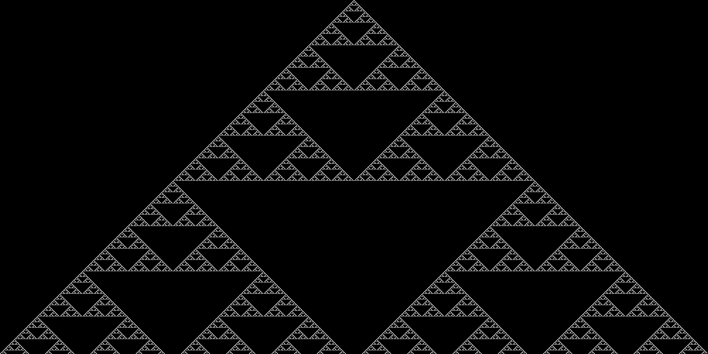

# py-cellular-automata
A class to draw cellular automata development as an image.

Usage example:

    import imageio
    from cellular_automaton import CellularAutomaton

    ca = CellularAutomaton(rule=90, n_iterations=500, random_seed=False)
    img = ca.generate()
    imageio.imsave('ca_output.gif', img)

Parameters:

- rule: the rule the CA follows
- n_iterations: the number of iterations to run the rule
- random_seed: determines if 0-generation is random or "single pixel"

Example output for rule 90:

